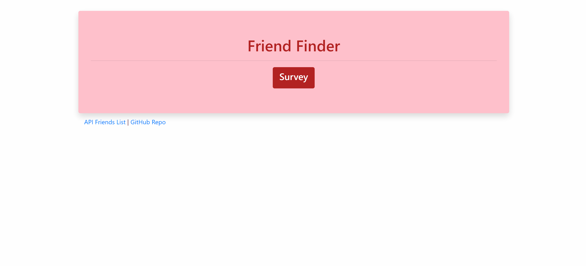
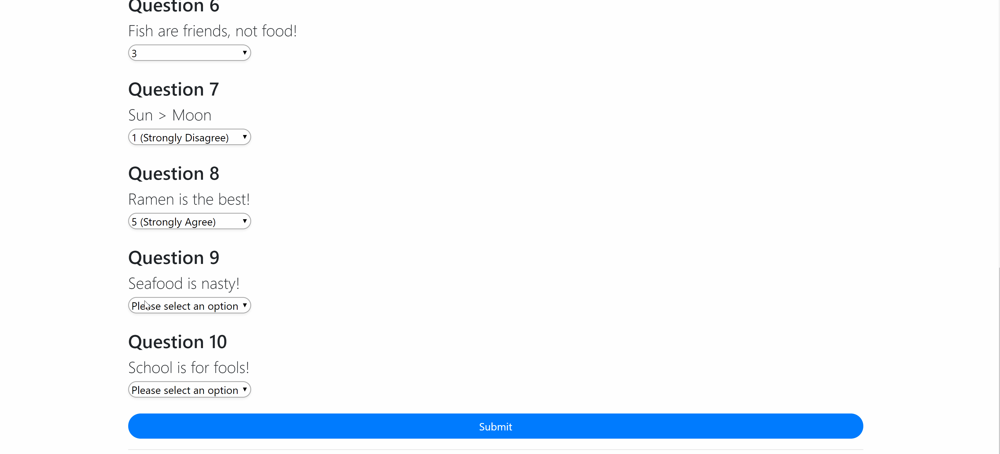

# Friend-finder

Friend finder is a friend matching app based on the user's responses to a ten question survey. The user responds to questions with values from 1 (Strongly Disagree) to 5 (Strongly Agree). When the survey is submitted, an existing user record closest to the current user's responses is found and returned.

Friend finder is meant to simulate a simple dating app. The application is implemented using a [Node.js](https://nodejs.org/en/) and [Express](https://expressjs.com/) server on the back end and the [Materialize](http://materializecss.com/) CSS framework on the front end.

## Demo
	
Please check it out [here](https://dashboard.heroku.com/apps/serene-castle-23522).
 

## Installation

To install the application follow the instructions below *(in your Git terminal)*

	git clone git@github.com:bksaechao/friend-finder.git
	cd friend-finder

	npm install or npm i
	
After the dependencies have been installed, run the application with the command below.

	npm start
	
The application will now be running locally on `PORT`. You can then access it locally from your browser at the URL `localhost:PORT`, in this case `localhost:3000`.
